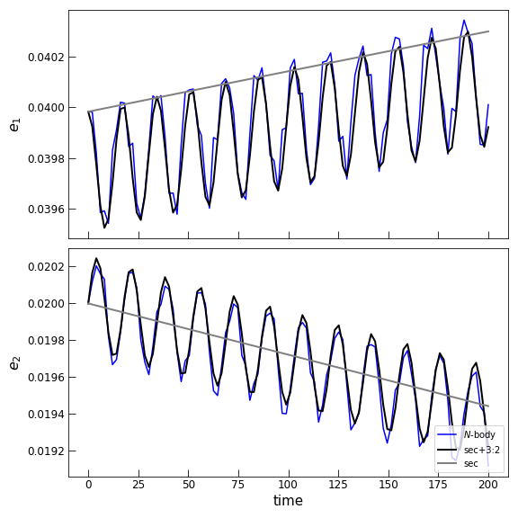
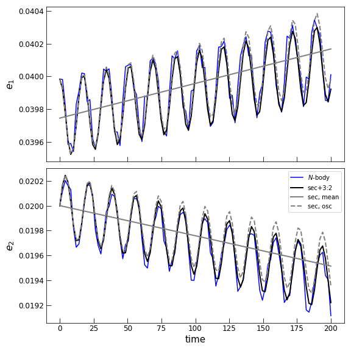

.. _canonical_transformations:

Canonical Transformations
=========================

A transformation of canonical variables :math:`T:({q},{p}) \rightarrow
({q}',{p}')` that leaves Hamilton's equations unaltered so that 

.. math::
        \begin{align}
        \frac{d}{dt}q' &= \frac{\partial}{\partial p'} H(q(q',p'),p(q',p')) \\
        \frac{d}{dt}p' &= -\frac{\partial}{\partial q'} H(q(q',p'),p(q',p'))
        \end{align}

is called a canonical transformation. Often the equations of motion encountered
in celestial mechanics problems can be simplified by appropriately chosen 
canonical coordinate trasformations.

This documentation isn't an introduction to canonical transformations, though
there are several standard references, e.g., `Goldstein's Classical Mechanics <https://www.amazon.com/Classical-Mechanics-3rd-Herbert-Goldstein/dp/0201657023/ref=asc_df_0201657023/?tag=hyprod-20&linkCode=df0&hvadid=312130957577&hvpos=&hvnetw=g&hvrand=11373300976445451730&hvpone=&hvptwo=&hvqmt=&hvdev=c&hvdvcmdl=&hvlocint=&hvlocphy=9003940&hvtargid=pla-570211389728&psc=1>`_.

The ``CanonicalTransformation`` class
-------------------------------------

The class
:class:`~celmech.canonical_transformations.CanonicalTransformation`
provides a framework for composing and applying such transformations.
An instance of a
:class:`~celmech.canonical_transformations.CanonicalTransformation`
is initialized with a set of rules for transforming from old to new
variables and vice versa. These rules can be applied to any
expressions involving canonical variables by using the
:meth:`~celmech.canonical_transformations.CanonicalTransformation.old_to_new`
and
:meth:`~celmech.canonical_transformations.CanonicalTransformation.new_to_old`
methods. Additionally, the canonical transformation can be applied to
a :class:`~celmech.hamiltonian.Hamiltonian` instance in order to
produce a new Hamiltonian object that has the new variables as
canonical variables and with the Hamiltonian appropriately transformed.

As an example, we'll apply a canonical transformation to simplify the
toy Hamiltonian

.. math::
        H(q,p) = \frac{p_{1}^{2}}{2} + p_{2}^{4} + p_{2} + \cos{\left(3 q_{1} + 2 q_{2} \right)}

First, we'll set up a :class:`~celmech.hamiltonian.Hamiltonian` object to
represent this system

.. code:: python

        from celmech import CanonicalTransformation, Hamiltonian, PhaseSpaceState
        import sympy as sp
        import numpy as np
        p1,p2,q1,q2 = sp.symbols("p(1:3),q(1:3)")
        H = p1**2/2 + p2 +  p2**4 + sp.cos(3*q1 + 2 * q2)
        state=PhaseSpaceState([q1,q2,p1,p2],np.random.uniform(-0.5,0.5,4))
        ham = Hamiltonian(H,{},state)

Next, we’ll build a canonical transformation to new variables
:math:`(Q_i,P_i)` according to :math:`\mathbf{Q} = T\cdot \mathbf{q}`
and :math:`\mathbf{P} = (T^{-1})^\mathrm{T} \cdot \mathbf{p}` for a
matrix :math:`T`. We’ll construct our transformations so that
:math:`Q_1 = 3q_1+2q_2`, the argument of the cosine term appearing in
the original Hamiltonian and we’ll set :math:`Q_2 = q_2`.

We use the :class:`~celmech.canonical_transformations.CanonicalTransformation`
class method
:meth:`~celmech.canonical_transformations.CanonicalTransformation.from_linear_angle_transformation`
to produce a
:class:`~celmech.canonical_transformations.CanonicalTransformation` instance
representing the desired transformation:

.. code:: python

    Tmtrx = [[3,2],[0,1]]
    qp_old = ham.qp_vars
    ct = CanonicalTransformation.from_linear_angle_transformation(qp_old,Tmtrx)

We examine the resulting transformation by expressing each old canonical
variable in terms of new variables and vice versa

.. code:: python

    for variable in ct.old_qp_vars:
        exprn = ct.old_to_new(variable)
        display((variable,exprn))
    
    for variable in ct.new_qp_vars:
        exprn = ct.new_to_old(variable)
        display((variable,exprn))

which produces the output

.. math::

    \displaystyle \left( q_{1}, \  \frac{Q_{1}}{3} - \frac{2 Q_{2}}{3}\right)

.. math::

    \displaystyle \left( q_{2}, \  Q_{2}\right)

.. math::

    \displaystyle \left( p_{1}, \  3 P_{1}\right)

.. math::

    \displaystyle \left( p_{2}, \  2 P_{1} + P_{2}\right)

.. math::

    \displaystyle \left( Q_{1}, \  3 q_{1} + 2 q_{2}\right)

.. math::

    \displaystyle \left( Q_{2}, \  q_{2}\right)

.. math::

    \displaystyle \left( P_{1}, \  \frac{p_{1}}{3}\right)

.. math::

    \displaystyle \left( P_{2}, \  - \frac{2 p_{1}}{3} + p_{2}\right)

Now we’ll use our canonical transformation to generate a new Hamiltonian
with the 
:meth:`~celmech.canonical_transformations.CanonicalTransformation.old_to_new_hamiltonian` method:

.. code:: python

    kam = ct.old_to_new_hamiltonian(ham,do_reduction=True)
    kam.H

The final line displays the transformed Hamiltonian in terms of the new variables:

.. math::

    \displaystyle \frac{9 P_{1}^{2}}{2} + 2 P_{1} + P_{2} + \left(2 P_{1} + P_{2}\right)^{4} + \cos{\left(Q_{1} \right)}

After the transformation, the Hamiltonian does not depend on :math:`Q_2`, so the
corresponding momentum variable, :math:`P_2`, is conserved.  By passing the
keyword argument ``do_reduction=True``, we have elected to generate a new
Hamiltonian in terms of the reduced phase space variables, :math:`(Q_1,P_1)` in
which the conserved quantity :math:`P_2` appears as a parameter instead of a
dynamical variable. 

The reduced Hamiltonian still keeps track the full set of phase space
variables, :math:`(Q_1,Q_2,P_1,P_2)`, through the
:attr:`~celmech.hamiltonian.Hamiltonian.full_qp` attribute.
This stores a dictionary-like representation where the variable symbols
serve as keys and their numerical values as the associated value
entries.

It is particularly useful to have access to these values in situations
where one wishes to carry out an integration or other calculation in the
reduced phase space reduced Hamiltonian, but express results in the
original phase space variables using the inverse canonical
transformation. However, as we will see below, the numerical value
stored for :math:`Q_2` in ``full_qp`` will **NOT** be updated according
to :math:`\frac{d}{dt}Q_2 = \frac{\partial}{\partial P_2}` when the
system is integrated forward in time.

Common transformations
**********************

The :class:`~celmech.canonical_transformations.CanonicalTransformation` class
provides a number of convenient class methods for initializing frequently used
canonical transformations.

The best way to get a feeling for these convenience functions is to see them 
applied to a real working problem:
`CanonicalTransformations.ipynb <https://github.com/shadden/celmech/blob/master/jupyter_examples/CanonicalTransformations.ipynb>`_.
A more advanced notebook using these functions is
`ResonantChain.ipynb <https://github.com/shadden/celmech/blob/master/jupyter_examples/ResonantChain.ipynb>`_.

The functions themselves include:

- :meth:`~celmech.canonical_transformations.CanonicalTransformation.cartesian_to_polar`
  implements a transformation taking user-specified canonical variable pairs
  :math:`(q_i,p_i)` to new variable pairs
  :math:`(Q_i,P_i)=\left((\tan^{-1}(q_i/p_i),\frac{1}{2}(q_i^2+p_i^2)\right)`

- :meth:`~celmech.canonical_transformations.CanonicalTransformation.polar_to_cartesian`
  implements a transformation taking user-specified canonical variable pairs
  :math:`(q_i,p_i)` to new variable pairs :math:`(Q_i,P_i)=\left(\sqrt{2p_i}\sin
  q_i,\sqrt{2p_i}\cos q_i\right)`

- :meth:`~celmech.canonical_transformations.CanonicalTransformation.from_linear_angle_transformation`
  produces the transformation
  :math:`(\pmb{q},\pmb{p})\rightarrow(\pmb{Q},\pmb{P})` given by 

  .. math::
    \begin{eqnarray}
         \pmb{Q} = T \cdot \pmb{q} ~&;~
         \pmb{P} = (T^{-1})^\mathrm{T} \cdot \pmb{p}
    \end{eqnarray}

  where :math:`T` is a user-specified invertible matrix (useful for constructing new angles
  from linear combinations of old angles).

- :meth:`~celmech.canonical_transformations.CanonicalTransformation.from_poincare_angles_matrix`
  takes a :class:`~celmech.poincare.Poincare` instance as input, along with an
  invertible matrix :math:`T`, and produces a transformation where the new
  canonical coordinates are linear combinations of the planets' angular orbital
  elements given by :math:`\pmb{Q} = T\cdot (\lambda_1 ,...,
  \lambda_N,-\varpi_1,... ,-\varpi_N,-\Omega_1 ,..., -\Omega_N)`.
  This is useful for constructing new angles from combinations of old angles when only
  a small number of angle combinations appear in the Hamiltonian.

- :meth:`~celmech.canonical_transformations.CanonicalTransformation.from_type2_generating_function`
  allows the user to specify a generating function
  :math:`F_2(\pmb{q},\pmb{P})` (see, e.g., the Goldstein textbook reference above)
  producing a canonical transformation that satisfies the equations

   .. math::

         \begin{eqnarray}
         \mathbf{Q} = \nabla_{\mathbf{P}}F_2~&;~
         \mathbf{p} = \nabla_{\mathbf{q}}F_2~.
         \end{eqnarray}

- :meth:`~celmech.canonical_transformations.CanonicalTransformation.rescale_transformation`
  allows users to simulaneously rescale the Hamiltonian and canonical variables.
  This is useful for choosing physical scale/units for the problem at hand.

- :meth:`~celmech.canonical_transformations.CanonicalTransformation.Lambdas_to_delta_Lambdas`
  transforms the :math:`\Lambda_i` variables of a
  :class:`~celmech.poincare.Poincare` instance to new variables
  :math:`\delta\Lambda_i=\Lambda_i - \Lambda_{i,0}`.
  Expanding around reference values of the $\Lambda_i$ is often useful since the $\Lambda_i$
  are always nonzero, and the changes in their values are typically very small.

Reducing Degrees of Freedom 
***************************

If the transformed Hamiltonian :math:`H' = H \circ T^{-1}` is independent of
one or more of the new canonical coordinate variables, :math:`q'_i`, then the
corresponding new momentum variable, :math:`p'_i` is a constant of motion.
Finding transformations that elminate the dependence on one or more degrees of
freedom allows one to consider a simpler, lower-dimensional Hamiltonian problem
involving only those conjugate variable pairs, :math:`(q'_i,p'_i)`, for which
both variables appear explicitly in the Hamiltonian.

Lie Series Transformations
--------------------------

``celmech`` offers functionality for doing canonical perturbation theory
calculations through the
:class:`~celmech.lie_transformations.FirstOrderGeneratingFunction` class. We
give a brief overview of canonical perturbation theory before describing the
:class:`~celmech.lie_transformations.FirstOrderGeneratingFunction` class below.

Overview of Canonical Perturbation Theory
*****************************************

Constructing a Hamiltonian with a finite number of disturbing function terms
implicitly assumes that an infinite number of other terms can be ignored
because they are rapdily oscillating such that there average effect on the
dynamics is negligible. In reality, these rapidly oscillating terms lead to
rapid oscillations in the dynamical variables under study. The goal of
canonical perturbation theory is to construct a near-identity canonical
transformation to new dynamical variables governed by a Hamiltonian that no
longer possesses these rapidly oscillating terms. Often, we will refer to the
original variables that show rapid oscillations as **osculating** variables and
the transformed variables for which these oscillations have been eliminated as
**mean** variables.  Lie series transformations provide a particularly elegant
means by which to construct such a transformation. If the following discussion
seems overly abstract, it may be helpful to reference the concrete example
presented :ref:`below<first order generating function>`.

A Lie series transformation is defined by its generating function,
:math:`\chi(q',p')`, a function of canonical variables.  The Lie
transformation, :math:`f\rightarrow f'` of a function :math:`f`, induced by a
particular generating function :math:`\chi`, is defined as

.. math::
        f'(q',p') = \exp[{\cal L}_\chi]f(q',p') = \sum_{n=0}^\infty \frac{1}{n!}{\cal L}_\chi^n f(q',p')

where :math:`{\cal L}_\chi= [\cdot,\chi]` is the Lie derivative with respect to
:math:`\chi`, i.e., the Poisson bracket of a function with :math:`\chi`.

Generally, the goal of applying a Lie transformation is to eliminate the
dependence of a Hamiltonian on a set of variables up to a specific order in
some small parameter.  In other words, usually one seeks to transform a
Hamiltonian of the form :math:`H = H_0(p) + \epsilon H_1(q,p) +
\epsilon^2H_2(q,p) + ...`, such that 

.. math::
        H'(q',p') = \exp[{\cal L}_\chi]H(q',p') = H'_0(p') + \epsilon^NH'_N(q',p')+....

where, in the new, transformed variables, :math:`(q',p')`, the Hamiltonian is
integrable if one ignores terms of order :math:`\epsilon^N` and smaller.  In
other words, :math:`p' = \exp[{\cal L}_{\chi(q,p)}]p` is a conserved quantity
up to order :math:`\epsilon^{N-1}`.

We'll focus on constructing the transformation to first order in
:math:`\epsilon`. If :math:`\chi\sim\mathcal{O}(\epsilon)`, then the
transformed Hamiltonian is

.. math::
        H'(q',p') = H_0(p') + \epsilon [H_0(p'),\chi(q',p')] + \epsilon H_1(q',p') + \mathcal{O}(\epsilon^2)~.

Thus, we can eliminate the :math:`q'` dependence of :math:`H'` if
:math:`[H_0(p'),\chi(q',p')] = -H_1(q',p')`. Suppose we can express the
perturbation Hamiltonian as a Fourier series in the variables :math:`q`:

.. math::
        H_{1}(q,p) = \sum_{\mathbf{k}} A_{\mathbf{k}}(p) e^{i\mathbf{k}\cdot q}~.

Then the condition :math:`[H_0(p'),\chi(q',p')] = -H_1(q',p')` can be written
as

.. math::
        \mathbf{\omega}(p') \cdot \nabla_q' \chi(q',p') = \sum_{\mathbf{k}} A_{\mathbf{k}}(p) e^{i\mathbf{k}\cdot q}
  
where :math:`\mathbf{\omega}(p') = \nabla_{p'}H_0(p')`. This equation is
readily solved by taking

.. math::
        \chi(q',p') = \sum_{\mathbf{k}} \frac{A_{\mathbf{k}}(p)}{i\mathbf{k}\cdot\omega(p')} e^{i\mathbf{k}\cdot q}

however, in order for this solution to be valid, we must have
:math:`\mathbf{k}\cdot\omega(p') \ne 0`. In other words, our transformation
cannot be applied to *resonant* domains of phase space. Generally, resonances
are dense in phase space, so our goal of eliminating any dependence on
:math:`q'` in the transformed Hamiltonian will not be possible. However we can
still eliminate non-resonant harmonics from the transformed Hamiltonian if we
only sum over :math:`\mathbf{k}` values that are non-resonant in whatever
region of phase-space we are interested in. More technically, if we are
intersted in some domain of action space, :math:`D`, then we should exclude the
set of :math:`\mathbf{k}` vectors

.. math:: 
        \mathcal{K}_\mathrm{res}(D) = \{ k ~|~ \exists p \in D \mathrm{~s.t.~} k \cdot \omega(p) =  0  \}

and define our generating function as

.. math::
       \chi(q',p') = \sum_{\mathbf{k}\notin \mathcal{K}_\mathrm{res}(D)} \frac{A_{\mathbf{k}}(p)}{i\mathbf{k}\cdot\omega(p')} e^{i\mathbf{k}\cdot q}~.

The sum above will generally include an inifinte number of :math:`k` vectors.
    However, the Fourier properties of smooth functions generally guarantee that
:math:`A_\mathbf{k}(p')\sim \exp(-|\mathbf{k}|_{1})` where
:math:`|\mathbf{k}|_{1}=\sum_i|k_i|`. If we're interested in constructing a
perturbation theory to first order in :math:`\epsilon`, then we only need to
include a limited number of terms with :math:`|\mathbf{k}|_1 < k_\mathrm{max}
\sim -\log\epsilon`.

.. _first order generating function:

The ``FirstOrderGeneratingFunction`` class
******************************************

``celmech`` provides the
:class:`~celmech.lie_transformations.FirstOrderGeneratingFunction` class for
applying Lie series transformations between osculating variables like those
integrated by via :math:`N`-body simulations, which include every harmonic in
the interaction potential between planet pairs, and mean variables appropriate
for Hamiltonian models built with the
:class:`~celmech.poincare.PoincareHamiltonian` class which typically include
only a small handful of harmonics from the interaction potential.  ``celmech``.
The resulting transformations will apply corrections at first order in
planet-star mass ratio.

A :class:`~celmech.lie_transformations.FirstOrderGeneratingFunction` instance
provides a representation of a the generating function, :math:`\chi`, for a Lie
series transformation. The user builds up this function by specifying which
terms from the disturbing function the transformation should eliminate from
the full Hamiltonian at first order in planet masses. The interface for adding
disturbing function terms is very similar to the interface for adding terms to
a :class:`~celmech.poincare.PoincareHamiltonian` object.  (In fact, the
:class:`~celmech.lie_transformations.FirstOrderGeneratingFunction` is a special
sub-class of :class:`~celmech.poincare.PoincareHamiltonian` that simple
overwrites the methods for adding disturbing function terms and adds some
additional functionality.)

.. _lie_series_example:

An example
^^^^^^^^^^

As usual, the most straightforward way to understand how this class works is by
way of example. Let's suppose we want to study the secular dynamics of a pair
of planets near, but not in, a 3:2 MMR. We begin by setting up a ``rebound``
simulation:

.. code:: python

    sim = rebound.Simulation()
    sim.add(m=1)
    sim.add(m=1e-5,P = 1, e=0.04)
    sim.add(m=1e-5,P = (3/2) * ( 1 + .03), e=0.02,pomega = np.pi/2,l=0)
    sim.move_to_com()

We'll set up two corresponding :class:`~celmech.poincare.PoincareHamiltonian`
simulations, one modeling just the effect of secular terms (``pham_sec``) and
one accounting for the effect of secular terms as well as the 3:2 MMR
(``pham_full``):

.. code:: python

    pvars_sec, pvars_full = [Poincare.from_Simulation(sim) for _ in range(2)]
    pham_sec = PoincareHamiltonian(pvars_sec)
    pham_full = PoincareHamiltonian(pvars_full)
    for pham in (pham_sec,pham_full):
        pham.add_secular_terms(inclinations=False)
    pham_full.add_MMR_terms(3,1)

Performing integrations with the two models and :math:`N`-body, and plotting a
comparison, we observe the following eccentricity behaviour:

All three models show the same overall long-term eccentricity trends but the
:math:`N`-body model shows some short-term oscillations that comparison with
the :code:`pham_full` model reveals is mainly due to the effects of the 3:2
MMR. Next, we'll capture these oscillations using a Lie series transformation.

Incorporating Lie transformations
^^^^^^^^^^^^^^^^^^^^^^^^^^^^^^^^^

Now we'll redo our integration with the secular model while using the Lie
transformation methods and the
:class:`~celmech.lie_transformations.FirstOrderGeneratingFunction` class to
account for these oscillations. We'll still be integrating our purely secular
equtions of motion but the application of the Lie series transformation will
allow us to approximate the effect of the 3:2 terms using a perturbative
approach.  We'll construct a first-order generating function
that eliminates the oscillating terms

.. code:: python

   H_3to2 = pham_full.H - pham_sec.H
   H_3to2

.. math:: \begin{multline} -
   \frac{C_{(3,-2,-1,0,0,0)}^{(0,0,0,0),(0,0)}(\alpha_{1,2}) G m_{1} m_{2}
   \left(\frac{\eta_{1} \sin{\left(2 \lambda_{1} - 3 \lambda_{2}
   \right)}}{\sqrt{\Lambda_{1,0}}} + \frac{\kappa_{1} \cos{\left(2 \lambda_{1}
   - 3 \lambda_{2} \right)}}{\sqrt{\Lambda_{1,0}}}\right)}{a_{2,0}} \\-
     \frac{C_{(3,-2,0,-1,0,0)}^{(0,0,0,0),(0,0)}(\alpha_{1,2}) G m_{1} m_{2}
     \left(\frac{\eta_{2} \sin{\left(2 \lambda_{1} - 3 \lambda_{2}
     \right)}}{\sqrt{\Lambda_{2,0}}} + \frac{\kappa_{2} \cos{\left(2
     \lambda_{1} - 3 \lambda_{2}
     \right)}}{\sqrt{\Lambda_{2,0}}}\right)}{a_{2,0}} \end{multline}

We construct our desired transformation using:

.. code:: python

   from celmech.lie_transformations import FirstOrderGeneratingFunction
   pchi = FirstOrderGeneratingFunction(pham_sec.state)
   pchi.add_MMR_terms(3,1)
   pchi.chi

.. math:: \begin{multline} -
   \frac{C_{(3,-2,-1,0,0,0)}^{(0,0,0,0),(0,0)}(\alpha_{1,2}) G m_{1} m_{2}
   \left(\frac{\eta_{1} \cos{\left(2 \lambda_{1} - 3 \lambda_{2}
   \right)}}{\sqrt{\Lambda_{1,0}}} - \frac{\kappa_{1} \sin{\left(2 \lambda_{1}
   - 3 \lambda_{2} \right)}}{\sqrt{\Lambda_{1,0}}}\right)}{a_{2,0}
     \left(\frac{3 G^{2} M_{2}^{2} \mu_{2}^{3}}{\Lambda_{2}^{3}} - \frac{2
     G^{2} M_{1}^{2} \mu_{1}^{3}}{\Lambda_{1}^{3}}\right)} 
     \\
     -
     \frac{C_{(3,-2,0,-1,0,0)}^{(0,0,0,0),(0,0)}(\alpha_{1,2}) G m_{1} m_{2}
     \left(\frac{\eta_{2} \cos{\left(2 \lambda_{1} - 3 \lambda_{2}
     \right)}}{\sqrt{\Lambda_{2,0}}} - \frac{\kappa_{2} \sin{\left(2
     \lambda_{1} - 3 \lambda_{2}
     \right)}}{\sqrt{\Lambda_{2,0}}}\right)}{a_{2,0} \left(\frac{3 G^{2}
     M_{2}^{2} \mu_{2}^{3}}{\Lambda_{2}^{3}} - \frac{2 G^{2} M_{1}^{2}
     \mu_{1}^{3}}{\Lambda_{1}^{3}}\right)}
     \end{multline}

This is precisely the generating function that eliminates the desired terms at
first order. We can even confirm the equation :math:`[H_\mathrm{Kep},\chi] =
-H_{3:2}`, where :math:`H_{3:2}` are the oscillating terms associated with the
3:2 MMR, using ``sympy``:

.. code:: python

   Hkep = PoincareHamiltonian(Poincare.from_Simulation(sim))
   sp.simplify(pchi.Lie_deriv(Hkep.H) + H_3to2)

where the last line evaluates to 0. Now we do the integration:

.. code:: python

   N = 100
   Tfin = 200
   times = np.linspace(0,Tfin,N)
   e_sec_mean,e_sec_osc = np.zeros((2,2,N))
   for i,t in enumerate(times):
    # convert initial osculating values to mean ones
    pchi.osculating_to_mean()
    pham_sec.integrate(t)
    for j,p in enumerate(pham_sec.particles[1:]):
        e_sec_mean[j,i] = pham_sec.particles[j+1].e

    pchi.mean_to_osculating()
    # convert mean back to
    for j,p in enumerate(pham_sec.particles[1:]):
        e_sec_osc[j,i] = pham_sec.particles[j+1].e

The calls to
:meth:`~celmech.lie_transformations.FirstOrderGeneratingFunction.osculating_to_mean`
and
:meth:`~celmech.lie_transformations.FirstOrderGeneratingFunction.mean_to_osculating`
convert the values of of the canonical variables stored by ``pham_sec.state``
back and forth between the "primed" and "unprimed" values related by
:math:`(q',p') = \exp[\mathcal{L}_{\chi}](q,p)` so that :code:`e_sec_mean` will
store "mean" values that evolve according to the Hamiltonian :code:`pham_sec.H`
while :code:`e_sec_osc` includes oscillations due to the 3:2 MMR terms. These
oscillations are computed analytically using the Lie transformation formalism.
Comparing our solutions for the osculating and mean eccentricities to the
results of our original integrations, we find

Now the 'mean' eccentricity variables track the overall trend and we've
eliminated the initial offset of these mean values by applying
``osculating_to_mean`` before commencing the integration. The
analytically-calculated correction from mean to osculating variables also match
nicely with the direct integration of both the Hamiltonian, ``pham_full``, as
well as direct :math:`N`-body. 

The mean eccentricity trends of our simple secular model acutally begins to
diverge somewhat from the integration of the fuller Hamiltonian model,
suggesting a small frequency difference  in the secular frequencies between the
two models. This small frequency difference arises from terms that are second
order in mass. Normally such terms would be negligible, but they are amplified
by a small denominator in this case because the system lies near the 3:2 MMR.
Second-order in mass corrections and the effect of nearby MMRs are discussed in
the Section :ref:`'Corrections to Secular Dynamics Near
Resonance'<secular-corrections>`.

Complete Elimination of 0th Order Terms
^^^^^^^^^^^^^^^^^^^^^^^^^^^^^^^^^^^^^^^

In the :ref:`example<lie_series_example>` presented above, we
used a Lie series transformation to eliminate two disturbing
function harmonics with frequency :math:`3n_2 - 2n_1` from the
Hamiltonian by adding two corresponding terms to the generating
function. When adding individual terms to the generating function
in this fashion, we are typically limited in the number of terms we can
practically eliminate from the transformed Hamiltonian.  However,
it is possible with the addition of a single term to the
generating function to eliminate *all* harmonics of the synodic
frequency, :math:`n_\mathrm{syn} = n_1 - n_2`, to zeroth order in
eccentricities and inclinations. For circular, planar orbits, the
interaction Hamiltonian is

.. math:: 
        H_{\mathrm{int},0} = \frac{Gm_jm_i}{a_j}
        \left(
          P(\lambda_j - \lambda_i; \alpha_{ij})
          -\frac{1}{\sqrt{\alpha}}\cos(\lambda_i-\lambda_j)
        \right)

where 

.. math::
        P(\psi;\alpha)=\frac{1}{\sqrt{1 + \alpha^2 - 2\alpha\cos(\psi)}}~.

The oscillating part of this interaction term can be eliminated at first order
in planet masses  with the generating function

.. math:: \chi_{0} =
   -\frac{Gm_im_j}{a_jn_\mathrm{syn}}\left(-\frac{1}{\sqrt{\alpha_{ij}}}\sin({\lambda_i-\lambda_j})
   + \int^{\lambda_i-\lambda_j}_{0}\left(P(\psi,\alpha_{ij}) -
     \bar{P}(\alpha_{ij})\right) d\psi \right)~,
        

where :math:`\bar{P}(\alpha) =
\frac{1}{2\pi}\int_{-\pi}^{\pi}P(\psi,\alpha)d\psi` is the mean value of
:math:`P(\psi,\alpha)`. The integral over :math:`\psi` can be expressed in
closed form using elliptic functions as

.. math::
   \int^{\psi}_{0}\left(P(\psi',\alpha) - \bar{P}(\alpha)\right) d\psi'
    =
    \frac{2}{1-\alpha}F\left(\frac{\psi}{2}\bigg|-\frac{4\alpha}{(1-\alpha)^2}\right)
    -
    \frac{2}{\pi}\mathbb{K}(\alpha^2)\psi

where :math:`\mathbb{K}` and :math:`F` are complete and incomplete elliptic
integrals of the first kind, respectively. The term, :math:`\chi_0` that
eliminates all zeroth order harmonics from the interaction Hamiltonian can be
added to the generating function represented by a
:class:`~celmech.lie_transformations.FirstOrderGeneratingFunction` instance
using the
:meth:`~celmech.lie_transformations.FirstOrderGeneratingFunction.add_zeroth_order_term`
method.

API
---

.. autoclass:: celmech.canonical_transformations.CanonicalTransformation
        :members:

.. autoclass:: celmech.lie_transformations.FirstOrderGeneratingFunction
        :members:
