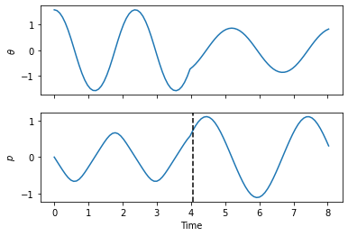

.. _hamiltonian:

Generic Hamiltonians
====================

Introduction
------------

The :class:`~celmech.poincare.PoincareHamiltonian` class is a special sub-class
of the more general :class:`~celmech.hamiltonian.Hamiltonian` class that
``celmech`` uses to model generic Hamiltonian system.  We will illustrate some
of the basic features of the class by using it to model the dynamics of a
simple pendulum.

.. code:: python

    import numpy as np
    from sympy import symbols,cos,sqrt
    from celmech.hamiltonian import Hamiltonian,PhaseSpaceState
    p,theta,m,g,l=symbols("p,theta,m,g,l")
    H = p*p/2/(m*l*l) + (m*g*l) * (1 - cos(theta))
    theta0,p0=np.pi/2,0
    state = PhaseSpaceState([theta,p],[theta0,p0])
    pars=dict()
    pars[g]=9.8
    pars[l] = 1
    pars[m] = 0.15
    ham = Hamiltonian(H,pars,state)
    ham.H

To initialiazie a :class:`~celmech.hamiltonian.Hamiltonian` one must specify a
sympy symbolic representation of the Hamiltonian, a dictionary specifying the
numerical values of any symbolic parameters appearing in the Hamiltonian, and a
:class:`~celmech.hamiltonian.PhaseSpaceState` object to represent the phase
space position of the system. The final line of the code block above will
display a symbolic representation of the Hamiltionan:

.. math::

    \displaystyle g l m \left(1 - \cos{\left(\theta \right)}\right) + \frac{p^{2}}{2 l^{2} m}

Our :class:`~celmech.hamiltonian.Hamiltonian` instance also automatically
generates and stores symbolic representations of the equations of motion and
their Jacobian with respect to the canonical variables under the attributes
:attr:`~celmech.hamiltonian.Hamiltonian.flow`, and
:attr:`~celmech.hamiltonian.Hamiltonian.jacobian`:

.. code:: python

   ham.flow

.. math::

   \left[\begin{matrix}\frac{p}{l^{2} m}\\- g l m \sin{\left(\theta \right)}\end{matrix}\right]

   
.. code:: python

   ham.jacobian

.. math::

   \left[\begin{matrix}0 & \frac{1}{l^{2} m}\\- g l m \cos{\left(\theta \right)} & 0\end{matrix}\right]

After :class:`~celmech.hamiltonian.Hamiltonian` instance is initialized, it
provides multiple attibutes that represent the Hamiltonian function itself, as
well as the flow generated by Hamilton's equations, and the Jacobian of those
equations: 

- The attributes :attr:`~celmech.hamiltonian.Hamiltonian.H`,
  :attr:`~celmech.hamiltonian.Hamiltonian.flow`, and
  :attr:`~celmech.hamiltonian.Hamiltonian.jacobian` provide symbolic
  representations of the Hamiltonian, flow vector, and its Jacobian with
  respect to the canonical variables.  

- The attributes :attr:`~celmech.hamiltonian.Hamiltonian.N_H`,
  :attr:`~celmech.hamiltonian.Hamiltonian.N_flow`, and
  :attr:`~celmech.hamiltonian.Hamiltonian.N_jacobian` provide expressions for
  the Hamiltonian, flow, and Jacobian with numerical values of any parameters
  substituted.  

- The attributes :attr:`~celmech.hamiltonian.Hamiltonian.H_func`,
  :attr:`~celmech.hamiltonian.Hamiltonian.N_func`, and
  :attr:`~celmech.hamiltonian.Hamiltonian.N_junc` provide functions for the
  Hamiltonian, flow, and Jacobian that take numerical values of the canonical
  variables as arguments 

- The methods :meth:`~celmech.hamiltonian.Hamiltonian.calculate_H`,
  :meth:`~celmech.hamiltonian.Hamiltonian.calculate_flow`, and
  :meth:`~celmech.hamiltonian.Hamiltonian.calculate_jacobian` evaluate the
  aforementioned functions at the current phase space position of the system,
  stored as the :attr:`~celmech.hamiltonian.Hamiltonian.values` attribue.

Hamilton's equations of motion can be integrated using the
:meth:`~celmech.hamiltonian.Hamiltonian.integrate` method. When this method is
called, the internal phase space state stored by the
:class:`~celmech.hamiltonian.Hamiltonian` under the
:attr:`~celmech.hamiltonian.Hamiltonian.state` attribute is automatically
updated. Furthermore, if any changes are made to the parameters of the
Hamiltonian, the equations of motion are updated accordingly.  The short
integration loop below illustrates these prinicpals:

.. code:: python

    omega0 = float(sqrt(g/l).subs(ham.H_params))
    T0 = 2 * np.pi / omega0
    times  = np.linspace(0,4*T0,100)
    soln = np.zeros((len(times),len(ham.N_dim)))
    
    for i,t in enumerate(times):
        # Double the length of of the pendulum at the  50th step
        if i==50:
            ham.H_params[l] *= 2
        ham.integrate(t)
        soln[i]=ham.state.values

.. code:: python

    from matplotlib import pyplot as plt
    fig,ax = plt.subplots(2,1,sharex=True)
    ax[0].plot(times,soln[:,0])
    ax[0].set_ylabel(r"$\theta$")
    ax[1].plot(times,soln[:,1],label="$p$")
    ax[1].set_ylabel(r"$p$")
    ax[1].set_xlabel("Time")
    plt.axvline(times[50],ls='--',color='k')

The resulting plot shows the evolution of the angle, :math:`\theta`, and
momentum, :math:`p`. Note the discontinuity in the motion corresponding to when
the length of the pendulum was changed in the integration loop:

API
---

.. autoclass:: celmech.hamiltonian.Hamiltonian
        :members:
        :special-members: __init__

.. autoclass:: celmech.hamiltonian.PhaseSpaceState
        :members:
        :special-members: __init__
