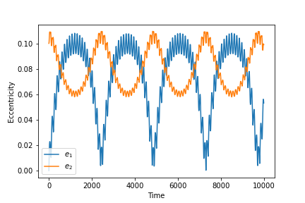

.. _nbody_simulation_utilities:

N-body simulation utilities
===========================

In addition to the main features designed for creating and working with symbolic expressions,
``celmech`` provides a number of utility functions for working with REBOUND simulations.

The :func:`get_simarchive_integration_results<celmech.nbody_simulation_utilities.get_simarchive_integration_results>` function
provides a convenient means of reading the data stored in a `rebound` `SimulationArchive`_.
The method takes a simulation archive file as input and returns a dictionary containing the times of each snapshot along with
the orbital elements of each planet in the simulation at those snapshots. 
We illustrate this with a short example below.

First, we run a short simulation of a pair of planets, saving results to a simulation archive:

.. code:: python

        import rebound as rb
        sim = rb.Simulation()
        sim.add(m=1)
        sim.add(m=1e-4,P=1)
        sim.add(m=1e-4,P=2,e=0.1)
        sim.automateSimulationArchive("save.sa",interval = 10.)
        sim.integrate(1e4)

Now, we'll use :func:`get_simarchive_integration_results<celmech.nbody_simulation_utilities.get_simarchive_integration_results>` to read the results of our simulation.

.. code:: python

        from celmech.nbody_simulation_utilities import get_simarchive_integration_results
        results = get_simarchive_integration_results("save.sa")

To see the contents of ``results``, we can print the dictionary keys:

.. code:: python

        print(results.keys())

which should produce 

.. code:: python

        dict_keys(['time', 'P', 'e', 'l', 'inc', 'pomega', 'omega', 'Omega', 'a', 'Energy'])

Finally, we'll use the contents of our ``results`` dictionary to plot the planets' eccentricities versus time:

.. code:: python

        import matplotlib.pyplot as plt
        plt.plot(results['time'],results['e'][0],label="$e_1$")
        plt.plot(results['time'],results['e'][1],label="$e_2$")
        plt.xlabel("Time")
        plt.ylabel("Eccentricity")
        plt.legend()

and we get the following plot:

Other convenient simulations utilities include:
    1. :func:`set_time_step<celmech.nbody_simulation_utilities.set_time_step>`
       sets the time step of a simulation to a user-specified fraction of the
       shortest perihelion passage timescale.
    2. :func:`calculate_mutual_inclinations<celmech.nbody_simulation_utilities.calculate_mutual_inclinations>` computes the mutual inclinations between pairs of planets in a simulation.
    3. :func:`align_simulation<celmech.nbody_simulation_utilities.align_simulation>` aligns a ``rebound`` simulation so that the total angular momentum is oriented along the 
       :math:`z` axis.

.. _SimulationArchive: https://github.com/hannorein/rebound/blob/main/ipython_examples/SimulationArchive.ipynb

API
---

.. automodule:: celmech.nbody_simulation_utilities
        :members: set_time_step,set_min_distance,get_simarchive_integration_results,get_canonical_heliocentric_orbits, add_canonical_heliocentric_elements_particle, align_simulation, calculate_mutual_inclinations

