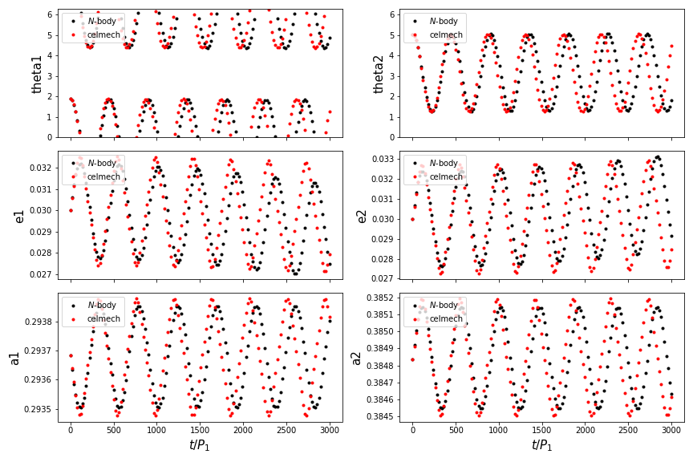

.. _install:

Installation
============

Requirements
------------

Installation of ``celmech`` will require a few additional Python packages. 

GitHub
------

In order to install ``celmech`` you will first need to clone the GitHub repository located `here <https://github.com/shadden/celmech>`_. This can be accomplished from the terminal by first navigating to the desired target directory and then issuing the command::

        git clone https://github.com/shadden/celmech.git

After you have cloned the git repository, navigate into the top celmech directory and issue the terminal command::
        
        python setup.py install

in order to install the Python package.

Pip
---
Coming soon!

.. _first_example:

A First Example
===============

Now that ``celmech`` is installed, we'll run through a short example of how to use it. In our example we'll use it in conjunction with the ``REBOUND`` N-body integrator to build and integrate a simple Hamiltonian model for the dynamics of a pair of planets in a mean motion resonance.
The example presented below is also available as a `Jupyter notebook on GitHub <https://github.com/shadden/celmech/tree/master/jupyter_examples/QuickstartExample.ipynb>`_.

Setup
-----

We'll start by importing the requisite packages.

.. code:: python

        import numpy as np
        import rebound as rb
        from celmech import Poincare, PoincareHamiltonian
        from sympy import init_printing
        init_printing() # This will typeset symbolic expressions in LaTeX

Now we'll initialize a REBOUND simulation containing a pair of Earth-mass planets orbiting a central solar-mass star with a 3:2 period ratio commensurability.

.. code:: python

        sim = rb.Simulation()
        sim.add(m=1,hash='star')
        sim.add(m=3e-6,P = 1, e = 0.03,l=0)
        sim.add(m=3e-6,P = 3/2, e = 0.03,l=np.pi/5,pomega = np.pi)
        sim.move_to_com()
        rb.OrbitPlot(sim,periastron=True)

After running the above code, we should see a represntation of our planetary system:

.. image:: images/quickstart_orbit_plot.png
        :width: 300

We'd like a construct a Hamiltonian that can capture the dynamical evolution of the system. 
To start, we'll initialize a :class:`celmech.Poincare <celmech.poincare.Poincare>` object in order to represent our system
and a :class:`celmech.PoincareHamiltonian <celmech.poincare.PoincareHamiltonian>` object to model its dynamical evolution. 
These objects can be initialized directly from the ``REBOUND`` simulation that we created above:

.. code:: python
        
        pvars = Poincare.from_Simulation(sim)
        pham = PoincareHamiltonian(pvars)

Now that we've now generated a :class:`poincare.PoincareHamiltonian <celmech.poincare.PoincareHamiltonian>` object, 
we'll examine the symbolic expression for the Hamiltonian governing our system:

.. code:: python

        pham.H

which should display:

.. math::

        - \frac{G^{2} M_{2}^{2} m_{2}^{3}}{2 \Lambda_{2}^{2}} - \frac{G^{2} M_{1}^{2} m_{1}^{3}}{2 \Lambda_{1}^{2}}

This expression is the just Hamiltonian of two non-interacting Keplerian orbits expressed in canonical variables used by ``celmech``.
The canonical momenta for the :math:`i`-th planet are defined [#]_ in terms of the planet's standard `orbital elements <https://en.wikipedia.org/wiki/Orbital_elements>`_ :math:`(a_i,e_i,I_i,\lambda_i,\varpi_i,\Omega_i)` and mass parameters :math:`\mu_i\sim m_i` and :math:`M_i \sim M_*`:

.. math::
        \begin{align*}       
        \Lambda_i &= \mu_i \sqrt{G M_i a_i}\\
        \kappa_i &= \sqrt{2\Lambda_i(1-\sqrt{1-e_i^2})}\cos\varpi_i\\
        \sigma_i &= \sqrt{2\Lambda_i\sqrt{1-e_i^2}(1-\cos I_i)}\cos\Omega_i
        \end{align*}

and their conjugate coordinates are:

.. math::
        \begin{align*}
        \lambda_i & \\
        \eta_i &= -\kappa_i\tan\varpi_i \\
        \rho_i &= -\sigma_i\tan\Omega_i 
        \end{align*}

When a :class:`PoincareHamiltonian <celmech.poincare.PoincareHamiltonian>` is first initialized, it will only contain the 'Keplerian' terms of the Hamiltonian 
and will not contain any terms representing gravitaional interactions between the planets.  
This will result in quite boring dynamical evolution: the planets' mean longitudes, :math:`\lambda_i`, 
will simply increase linearly with time at a rate of 
:math:`n_i = \frac{G^{2} M_{2}^{2} m_{i}^{3}}{\Lambda_{i}^{3}}`, while all other orbital elements remain constant.

In order explore more interesting dynamics, we need to add terms to Hamiltonian that capture pieces of the gravitational interactions between planets.
Since our planet pair is near a 3:2 MMR, terms associated with this resonance are a natural choice to explore. 
For a pair of co-planar planets, these terms will all involve linear combinations of the two resonant angles 

.. math::
        \theta_1 = 3\lambda_2-2\lambda_1 - \varpi_1 \\
        \theta_2 = 3\lambda_2-2\lambda_1 - \varpi_2 

In fact, at lowest order in the planets' eccentricities, there are just two such terms,
:math:`\propto e_1\cos\theta_1` and :math:`\propto e_2\cos\theta_2`.
The method :meth:`add_all_MMR_and_secular_terms <celmech.poincare.PoincareHamiltonian.add_all_MMR_and_secular_terms>` provides a convenient
method for adding these terms to our Hamiltonian:

.. code:: python

        pham.add_all_MMR_and_secular_terms(3,1,1)
        pham.H

which should now display

.. math::

        - \frac{C^{0,0,0,0;(1,2)}_{0,0,0,0,0,0} G^{2} M_{2}^{2} m_{1}}{\Lambda_{2}^{2} M_{1}} m_{2}^{3} - \frac{C^{0,0,0,0;(1,2)}_{3,-2,-1,0,0,0} G^{2} M_{2}^{2} m_{1}}{\Lambda_{2}^{2} M_{1}} m_{2}^{3} \left(\frac{\eta_{1}}{\sqrt{\Lambda_{1}}} \sin{\left (2 \lambda_{1} - 3 \lambda_{2} \right )} + \frac{\kappa_{1}}{\sqrt{\Lambda_{1}}} \cos{\left (2 \lambda_{1} - 3 \lambda_{2} \right )}\right) - \frac{C^{0,0,0,0;(1,2)}_{3,-2,0,-1,0,0} G^{2} M_{2}^{2} m_{1}}{\Lambda_{2}^{2} M_{1}} m_{2}^{3} \left(\frac{\eta_{2}}{\sqrt{\Lambda_{2}}} \sin{\left (2 \lambda_{1} - 3 \lambda_{2} \right )} + \frac{\kappa_{2}}{\sqrt{\Lambda_{2}}} \cos{\left (2 \lambda_{1} - 3 \lambda_{2} \right )}\right) - \frac{G^{2} M_{2}^{2} m_{2}^{3}}{2 \Lambda_{2}^{2}} - \frac{G^{2} M_{1}^{2} m_{1}^{3}}{2 \Lambda_{1}^{2}}

This somewhat cumbersome expression is just equivalent to 

.. math::
        - \frac{GM_*m_1}{2 a_1} - \frac{GM_*m_2}{2 a_2}  - \frac{Gm_1m_2}{a_2}\left(C^{0,0,0,0;(1,2)}_{3,-2,-1,0,0,0}e_1\cos(3\lambda_2-2\lambda_1-\varpi_1) + C^{0,0,0,0;(1,2)}_{3,-2,0,-1,0,0} e_2\cos(3\lambda_2-2\lambda_1-\varpi_2)\right)
        
but expressed in the canonical variables used by ``celmech``. [#]_

Integration
-----------

Now that we have a Hamiltonain model, we'll integrate it and compare the results to direct :math:`N`-body.
First, we'll set up some preliminary python dictionaries and arrays to hold the results of both integrations.

.. code:: python

        # Here we define the times at which we'll get simulation outputs
        Nout = 150
        times = np.linspace(0 , 3e3, Nout) * sim.particles[1].P
        
        # These are the quantites we'll track in our rebound and celmech integrations
        keys = ['l1','l2','pomega1','pomega2','e1','e2','a1','a2'] 

        # These dictionaries will hold our results
        rebound_results= {key:np.zeros(Nout) for key in keys}
        celmech_results= {key:np.zeros(Nout) for key in keys}

        # These are the lists of particles in both simulations 
        # for which we'll save quantities.
        rb_particles = sim.particles
        cm_particles = pvars.particles

The :class:`celmech.PoincareHamiltonian` class inherits the method :meth:`celmech.hamiltonian.Hamiltonian.integrate` that can be used to evolve the system forward in much the same way as ``REBOUND``'s :meth:`rebound.Simulation.integrate` method.
Below is the main integration loop where we'll integrate our system and store the results: 

.. code:: python

        for i,t in enumerate(times):
            sim.integrate(t) # advance N-body
            pham.integrate(t) # advance celmech
            for j,p_rb,p_cm in zip([1,2],rb_particles[1:],cm_particles[1:]):
                # store N-body results
                rebound_results["l{}".format(j)][i] = p_rb.l
                rebound_results["pomega{}".format(j)][i] = p_rb.pomega
                rebound_results["e{}".format(j)][i] = p_rb.e
                rebound_results["a{}".format(j)][i] = p_rb.a

                # store celmech results
                celmech_results["l{}".format(j)][i] = p_cm.l
                celmech_results["pomega{}".format(j)][i] = p_cm.pomega
                celmech_results["e{}".format(j)][i] = p_cm.e
                celmech_results["a{}".format(j)][i] = p_cm.a

Finally, we'll plot the simulation results in order to compare them:

.. code:: python
        
        # First, we compute resonant angles for both sets of results
        for d in [celmech_results,rebound_results]:
            d['theta1'] = np.mod(3 * d['l2'] - 2 * d['l1'] - d['pomega1'],2*np.pi)
            d['theta2'] = np.mod(3 * d['l2'] - 2 * d['l1'] - d['pomega2'],2*np.pi)
        
        # Now we'll create a figure...
        import matplotlib.pyplot as plt
        fig,ax = plt.subplots(3,2,sharex = True,figsize = (12,8))
        for i,q in enumerate(['theta','e','a']):
            for j in range(2):
                key = "{:s}{:d}".format(q,j+1)
                ax[i,j].plot(times,rebound_results[key],'k.',label='$N$-body')
                ax[i,j].plot(times,celmech_results[key],'r.',label='celmech')
                ax[i,j].set_ylabel(key,fontsize=15)
                ax[i,j].legend(loc='upper left')

        #... and make it pretty
        ax[0,0].set_ylim(0,2*np.pi);
        ax[0,1].set_ylim(0,2*np.pi);
        ax[2,0].set_xlabel(r"$t/P_1$",fontsize=15);
        ax[2,1].set_xlabel(r"$t/P_1$",fontsize=15);
        
This should produce a figure that looks something like this:

Not too bad! Our ``celmech`` model reproduces the libration amplitudes and frequencies observed in the :math:`N`-body results quite successfully.

Next steps
----------

Check out ...

.. [#] The precise definitions of the orbital elements and mass parameters :math:`\mu_i,M_i` depend on the adopted coordinate system.  By default ``celmech`` uses canonical heliocentric coordinates.  
.. [#] The :math:`C` coefficients used by ``celmech`` are defined in :ref:`disturbing_function`. For those familiar with the notation of `Murray & Dermott (1999) <https://ui.adsabs.harvard.edu/abs/2000ssd..book.....M/abstract>`_, :math:`C^{0,0,0,0;(1,2)}_{3,-2,-1,0,0,0} = f_{27}(\alpha)` and :math:`C^{0,0,0,0;(1,2)}_{3,-2,0,-1,0,0} = f_{31}(\alpha)` evaluated at :math:`\alpha\approx (2/3)^{2/3}`.
