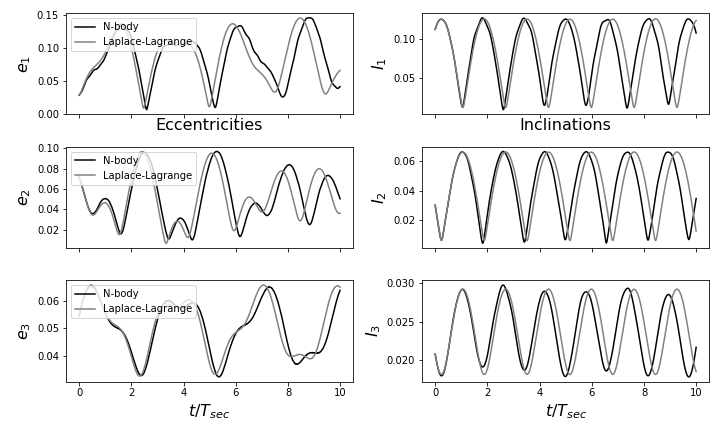
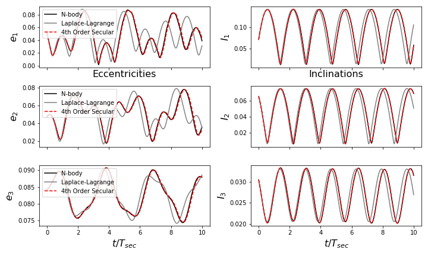

.. _secular:

Secular Module
==============

Introduction
------------

The secular module provides numerical tools to represent the secular or "orbit-averaged" dynamics of planetary systems. 
Secular dynamics are captured by :ref:`disturbing function <disturbing_function>` terms independent 
of the planets' mean longitudes.

``celmech`` provides two basic approaches to modeling a system's secular dynamics: the first is an analytic solution to the Laplace-Lagrange system, described below in :ref:`secular-ll`.
The second, described in :ref:`secular-nonlinear`, involves numerical integration of nonlinear differential equations derived from an expansion of the equations of motion up to a user-specified maximum order in inclinations and eccentricities.
Both methods can incorporate corrections to the equations of motion that are second order in planet-star mass ratios. 
These corrections are most important near low-order mean-motion resonances and are discussed below in :ref:`secular-corrections`.

.. _secular-ll:

Laplace-Lagrange Solution
-------------------------

The classical Laplace-Lagrange solution for the secular equations of motion is derived by expressing the orbit-averaged interaction potential to leading (i.e., second-) order in eccentrictites and inclinations.  At this level of approximation, the equations of motion separete into two independent sets of linear, first-order differential equations governing the eccentriticities and inclinations of the planets.
These equations may be written compactly as 

.. math::

        
        \frac{d}{dt}\pmb{x} = -\sqrt{-1}\pmb{S}_e \cdot \pmb{x}\\
        \frac{d}{dt}\pmb{y} = -\sqrt{-1}\pmb{S}_I \cdot \pmb{y}

where :math:`x_i = \frac{1}{\sqrt{2}}(\kappa_i - \sqrt{-1}\eta_i)` and :math:`y_i = \frac{1}{\sqrt{2}}(\sigma_i - \sqrt{-1}\rho_i)` and are derived from the 'Laplace-Lagrange' Hamiltonian:

.. math::

        H_\mathrm{LL} = \pmb{x} \cdot \pmb{S}_e \cdot \bar{\pmb{x}} + \pmb{y} \cdot \pmb{S}_I \cdot \bar{\pmb{y}}

or, in terms of orbital elements and the notation of `Murray & Dermott (1999) <https://ui.adsabs.harvard.edu/abs/1999ssd..book.....M/abstract>`_,

.. math::
        H_\mathrm{LL} = -\sum_{j=1}^{N}\sum_{i<j}\frac{Gm_im_j}{a_j}\left(
        f_2(e_i^2 + e_j^2) + f_{10}e_ie_j\cos(\varpi_i - \varpi_j)
        +
        f_3(s_i^2 + s_j^2) + f_{14}s_is_j\cos(\Omega_i - \Omega_j)\right)

The :class:`celmech.secular.LaplaceLagrangeSystem` class provides utilities for computing the analytic solution to these equations of motion as well as deriving a number of properties of this solution.  

A :class:`LaplaceLagrangeSystem <celmech.secular.LaplaceLagrangeSystem>` object can be initialized directly from a :class:`Poincare <celmech.poincare.Poincare>` object with
the :meth:`from_Poincare <celmech.secular.LaplaceLagrangeSystem.from_Poincare>` class method 
or from a :class:`rebound.Simulation` object using the 
:meth:`from_Simulation <celmech.secular.LaplaceLagrangeSystem.from_Simulation>` class method.

The example below illustrates a comparison between Laplace-Lagrange theory and N-body integration.

.. code:: python 

        import numpy as np
        import rebound as rb
        import matplotlib.pyplot as plt
        # We'll import some convenience functions for working with
        # REBOUND simulations
        from celmech.nbody_simulation_utilities import align_simulation, set_timestep
        from celmech.nbody_simulation_utilities import get_simarchive_integration_results

        # Define a function to initialize a rebound simulation. 
        def get_sim(scale = 0.05):
                sim = rb.Simulation()
                sim.add(m=1)
                for i in range(1,4):
                    sim.add(m=i * 1e-5 , a = 2**i,
                            e = np.random.rayleigh(scale),
                            inc = np.random.rayleigh(scale),
                            l = 'uniform',
                            pomega = 'uniform',
                            Omega = 'uniform'
                           )
                sim.move_to_com()
                align_simulation(sim)

                sim.integrator = 'whfast'
                sim.ri_whfast.safe_mode=0
                set_timestep(sim,1/40) # set timestep to 1/40th of shortest orbital period
                return sim

With our set-up complete, we'll generate :class:`LaplaceLagrangeSystem <celmech.secular.LaplaceLagrangeSystem>` instance 
directly from a REBOUND simulation:

.. code:: python

        from celmech.secular import LaplaceLagrangeSystem
        sim = get_sim()
        llsystem = LaplaceLagrangeSystem.from_Simulation(sim)

In order to compare the Laplace-Lagrange solution to N-body, we'll integrate the system for multiple secular timescales
and get the results using the :func:`get_simarchive_integration_results <celmech.nbody_simulation_utilities.get_simarchive_integration_results>` utility function:

.. code:: python

        Tsec = llsystem.Tsec # Shortest secular mode period of the system
        sim.automateSimulationArchive("secular_example.sa",interval=Tsec/100,deletefile=True)
        sim.integrate(10 * Tsec)
        sa = rb.SimulationArchive("secular_example.sa")
        nbody_results = get_simarchive_integration_results(sa)

:meth:`secular_solution <celmech.secular.LaplaceLagrangeSystem.secular_solution>` generates a secular solution as a dictionary:

.. code:: python

        llsoln = llsystem.secular_solution(nbody_results['time'])

We can now plot and compare our :math:`N`-body and secular solutions

.. code:: python

        fig,ax = plt.subplots(sim.N-1,2,sharex=True,figsize=(10,6))
        for i in range(sim.N-1):
        
            ax[i,0].plot(nbody_results['time'] / Tsec, nbody_results['e'][i],'k',label="N-body")
            ax[i,0].set_ylabel("$e_{}$".format(i+1),fontsize=16)
            ax[i,1].plot(nbody_results['time'] / Tsec, nbody_results['inc'][i],'k')
            ax[i,1].set_ylabel("$I_{}$".format(i+1),fontsize=16)
        
            ax[i,0].plot(llsoln['time']/ Tsec, llsoln['e'][i],'gray',label="Laplace-Lagrange")
            ax[i,1].plot(llsoln['time']/ Tsec, llsoln['inc'][i],'gray')
        
            ax[i,0].legend(loc='upper left')

which produces [#]_ 

In this case, we see fair agreement between Laplace-Lagrange theory and direct :math:`N`-body: the amplitudes and 
frequencies of eccentricity and inclination oscillations roughly agree. 
There are two shortcomings of the Laplace-Lagrange secular theory that can generally explain differences 
between analytic predictions and N-body integration results: 

        (1) Truncating the equations of motion at leading order in inclination and eccentricity may not be sufficient 
        (2) Period ratios near a mean motion commensurability can invalidate the secular averaging approximation 

We'll describe options for addressing both of these issues with ``celmech`` below.

.. _secular-nonlinear:

Nonlinear Secular Evolution
---------------------------

The secular equations of motion derived from a disturbing function expansion to degree 4 or higher in eccentricity and inclinationwill, in general, 
not have analytic solutions [#]_ .
Therefore, the equations of motion need to be integrated numerically.
``celmech`` provides two special classes designed for integrating secular equations of motion derived from 4th and higher order expansions of the 
Hamiltonian. 
The first class, which we'll use in the present example, is the :class:`SecularSystemSimulation <celmech.secular.SecularSystemSimulation>` class. 

A :class:`SecularSystemSimulation <celmech.secular.SecularSystemSimulation>` can also easily be initialized directly from a REBOUND simulation:

.. code:: python

        # grab first simulation archive snapshot
        sim0=sa[0]
        # intialize secular simulation object
        sec_sim = SecularSystemSimulation.from_Simulation(
            sim0,
            max_order = 4,
            dtFraction=1/100.,
            DFOp_kwargs={'rtol':1e-10}
        )

Let's briefly unpack the arguments passed to the :code:`from_Simulation` call above:
        - :code:`sim0` serves as the REBOUND simulation from which we'll intialize our :class:`SecularSystemSimulation <celmech.secular.SecularSystemSimulation>`
        - The :code:`max_order=4` keyword argument specifies that we want equations of motion derived from a 4th order expansion of the disturbing function.
        - the :code:`dtFraction=1/100.` tells ``celmech`` that we want to set our simulation time-step to 1/100 times the secular timescale. This secular timescale
          is estimated from the Laplace-Lagrange solution for the system (see :code:`llsys.Tsec` above). Note that 
          :class:`SecularSystemSimulation <celmech.secular.SecularSystemSimulation>` uses a fixed-step symplectic integration method.
        - The :code:`DFOp_kwargs={'rtol':1e-10}` sets the relative tolerance of our integration scheme.  
          In order to better understand what this means, we need to discuss how :class:`SecularSystemSimulation <celmech.secular.SecularSystemSimulation>`
          integrates the equations of motion.  

We'll return to the issue of just how :class:`SecularSystemSimulation <celmech.secular.SecularSystemSimulation>`
integrates the equations of motion below, but lets run our integration and compare results first.
In order to do so, we'll first define a wrapper function...  

.. code:: python

        def run_secular_sim(sec_sim,times, corrector=True):
                N = len(times)
                # orbital elements that we want to track
                eccN,incN,pomegaN,OmegaN = np.zeros((4,sec_sim.state.N - 1,N))

                # We'll also track error in two conserved quanties, 
                # the energy and the 'angular momentum deficit' or AMD
                Eerr = np.zeros(N)
                AMDerr = np.zeros(N)
                timesDone = np.zeros(N)
                E0 = sec_sim.calculate_energy()
                AMD0 = sec_sim.calculate_AMD()

                # main loop
                for i,time in enumerate(times):
                    sec_sim.integrate(time, corrector=corrector)
                    timesDone[i] = sec_sim.t
                    E = sec_sim.calculate_energy()

                    AMD = sec_sim.calculate_AMD()
                    Eerr[i] = np.abs((E-E0)/E0)
                    AMDerr[i] = np.abs((AMD-AMD0)/AMD0)
                    # sec_sim stores a Poincare object in its 'state' attribute
                    # the state is updated when the system is integrated.
                    for j,p in enumerate(sec_sim.state.particles[1:]):
                        eccN[j,i] = p.e
                        incN[j,i] = p.inc
                        pomegaN[j,i] = p.pomega
                        OmegaN[j,i] = p.Omega

                return timesDone, Eerr, AMDerr, eccN, incN,pomegaN,OmegaN

... and then integrate ...

.. code:: python

        T = np.linspace(0,sa[-1].t,150)
        times_sec, Eerr, AMDerr, ecc_sec, inc_sec,pomega_sec,Omega_sec = run_secular_sim(sec_sim,T)

... and finally compare with our previous results:

.. code:: python

        fig,ax = plt.subplots(sim.N-1,2,sharex=True,figsize=(10,6))
        for i in range(sim.N-1):
            # N-body
            ax[i,0].plot(nbody_results['time'] / Tsec, nbody_results['e'][i],'k',label="N-body")
            ax[i,0].set_ylabel("$e_{}$".format(i+1),fontsize=16)
            ax[i,1].plot(nbody_results['time'] / Tsec, nbody_results['inc'][i],'k')
            ax[i,1].set_ylabel("$I_{}$".format(i+1),fontsize=16)
        
            # Laplace-Lagrange
            ax[i,0].plot(llsoln['time']/ Tsec, llsoln['e'][i],'gray',label="Laplace-Lagrange")
            ax[i,1].plot(llsoln['time']/ Tsec, llsoln['inc'][i],'gray')
        
            # Secular Simulation
            ax[i,0].plot(times_sec/ Tsec, ecc_sec[i],'r--',label="4th Order Secular")
            ax[i,1].plot(times_sec/ Tsec, inc_sec[i],'r--')
        
        
            ax[i,0].legend(loc='upper left')

which should produce something like:

With higher-order terms in our secular equations of motion, we now have excellent agreement with :math:`N`-body!

Integration via splitting method
********************************
Before going on, we should discuss the integration method used by :class:`SecularSystemSimulation <celmech.secular.SecularSystemSimulation>`
and some of the corresponding options. 
:class:`SecularSystemSimulation <celmech.secular.SecularSystemSimulation>` relies on a second-order "splitting" method to solve Hamilton's equations. 
(The 'leapfrog' and `Wisdom-Holman <https://ui.adsabs.harvard.edu/abs/1991AJ....102.1528W/abstract>`_ integration methods are examples of splitting methods that may be familiar.)
Our method relies on representing the Hamiltonian governing the system as the sum of two pieces:

.. math::
        H_\mathrm{sec} = H_\mathrm{LL} + H_\mathrm{NL} \\

where :math:`H_\mathrm{NL}` containts all the terms of degree 4 and higher in the components of :math:`\pmb{x},\bar{\pmb{x}},\pmb{y},\mathrm{ and },\bar{\pmb{y}}`.

We can, of course, solve Hamilton's equations when the Hamiltonian is just :math:`H=H_\mathrm{LL}`-- this is simply the Laplace-Lagrange solution descibed :ref:`above <secular-ll>`.
Let's suppose for the moment that we can also solve the equations of motion when our Hamiltonian is just :math:`H=H_\mathrm{NL}`.
To continue, its helpful to introduce "operator notation" where :math:`\hat H(\tau)` denotes the operator advancing a system for time :math:`\tau` under the influence of the Hamiltonain :math:`H`. 
In other words, 
:math:`\hat H(\tau): \pmb{z}(0) \mapsto \pmb{z}(\tau)` where 
:math:`\pmb{z}(\tau)` 
is the solution to the initial value problem :math:`\frac{d}{dt}\pmb{z} = \Omega\cdot\nabla_{\pmb z}H(z)` with initial data :math:`\pmb{z}(0)`.
While we can't solve the equations of motion for :math:`H_\mathrm{sec}` exactly, we make a numerical integrator by approximating :math:`\hat{H_\mathrm{sec}}(\tau)` as

.. math::

        \hat{H_\mathrm{sec}}(\tau) \approx \hat{H_\mathrm{LL}}(\tau/2)\hat{H_\mathrm{NL}}(\tau)\hat{H_\mathrm{LL}}(\tau/2) + {\cal O}(\epsilon\tau^2)

where :math:`\epsilon = |H_\mathrm{NL}|/|H_\mathrm{LL}|\sim e^2 + I^2`.
In fact, by applying symplectic correctors, we can reduce the error of this integrator to :math:`{\cal O}(\epsilon\tau^4 + \epsilon^2\tau^2)` with relatively little computational expense.
:class:`SecularSystemSimulation <celmech.secular.SecularSystemSimulation>` will apply correctors when the :meth:`integrate <celmech.secular.SecularSystemSimulation.integrate>` method is called
with the keywoard argument :code:`corrector=True`.

There is, however, a catch to the splitting method described above:  we don't have a closed-form solution for the equations of motion generated by :math:`{H_\mathrm{NL}}` (if you have one we'd love to hear it!).
Therefore, instead of representing the operator :math:`\hat{H_\mathrm{NL}}(\tau)` exactly,
:class:`SecularSystemSimulation <celmech.secular.SecularSystemSimulation>` uses an approximate solution for this evolution operator. 
In particular, :class:`SecularSystemSimulation <celmech.secular.SecularSystemSimulation>` solves the equations of motion generated by :math:`H_\mathrm{NL}` approximately using Runge-Kutta methods. 
By default, :class:`SecularSystemSimulation <celmech.secular.SecularSystemSimulation>` uses a single implicit midpoint step of size :math:`\tau` as an approximation for :math:`\hat{H_\mathrm{NL}}(\tau)`.
There are, however, an array of options for exactly how :class:`SecularSystemSimulation <celmech.secular.SecularSystemSimulation>` approximates :math:`\hat{H_\mathrm{NL}}(\tau)`.
These options are specified as a dictionary through the keyword argument :code:`DFOp_kwargs`.
Details of avaliable options are described under the 

Runge-Kutta Integration 
***********************
With the :class:`SecularRKIntegrator <celmech.secular.SecularSystemRKIntegrator>` class, you can forego splitting and simply integrate the equations of motion directly using a user-specified Runge-Kutta method.

.. _secular-corrections:

Corrections to Secular Dynamics Near Resonance
----------------------------------------------

The secular dynamics of a multiplanet system can be significantly modified when one or more pairs of planets in the system lie near a low-order mean motion resonance. 
These corrections can be derived by applying canonical perturbation theory to second order in planet masses. 
In particular consider a system with a pair of planets, planets :math:`i` and :math:`j`, near (but not in) a :math:`p:p-q` MMR. 
A normal form Hamiltonian approximating the dynamics of the system is given by 

.. math::
 H=H_\mathrm{Kep}(\pmb{\Lambda}) + \epsilon H_\mathrm{sec}(\pmb{z},\bar{\pmb{z}},\pmb{\Lambda}) + \epsilon H_\mathrm{res}(\pmb{z},\bar{\pmb{z}},\pmb{\Lambda},\pmb{k}\cdot\pmb{\lambda})\\

where 

.. math::
 H_\mathrm{res} = \sum_{n=1}^\infty e^{\mathrm{i} n \pmb{k}\cdot\pmb{\lambda} } p_n(\pmb{z},\bar{\pmb{z}},\pmb{\Lambda}) + c.c.

and :math:`\pmb{k}\cdot\pmb{\lambda} = p\lambda_{j} - (p-q)\lambda_j`.
In order to derive a normal form governing the secular evolution of the system, we seek a canonical transformation that eliminates the the :math:`\lambda` dependence from our Hamiltonian.
In other words, we would like to find a Lie transformation such that :math:`H' = \exp[\epsilon{\cal L}_{\chi}] H` is independent of :math:`\pmb{\lambda}`.
To second order in :math:`\epsilon`, we have

.. math::
  H'= H_\mathrm{Kep}(\pmb{\Lambda}') +\epsilon\left(H_\mathrm{sec} + H_\mathrm{res} + \{H_\mathrm{Kep},\chi\}\right)\\
  + \epsilon^2\left(\{H_\mathrm{sec} + H_\mathrm{res},\chi\} + \frac{1}{2}\{\{H_\mathrm{Kep},\chi_1\},\chi\}\right)
    
In order to eliminate :math:`\pmb{\lambda}` to first order in :math:`\epsilon`, we can choose

.. math::
 \chi(\pmb{z}',\bar{\pmb{z}}',\pmb{\Lambda}',\pmb{\lambda}') = \sum_{n=1}^\infty e^{\mathrm{i} n\pmb{k}\cdot\pmb{\lambda}' } \frac{p_n(\pmb{z}',\bar{\pmb{z}}',\pmb{\Lambda}')}{\mathrm{i} n\pmb{k}\cdot\pmb{\omega}(\pmb{\Lambda}')} + c.c.

where we have defined :math:`\pmb{\omega}(\pmb{\Lambda}')\equiv \nabla_{\pmb{\Lambda}'}H_\mathrm{Kep}(\pmb{\Lambda}')`.
Inserting this into the expression for :math:`H'`, we have

.. math::
  H'= H_\mathrm{Kep}(\pmb{\Lambda}') + \epsilon H_\mathrm{sec}+ \epsilon^2\{H_\mathrm{sec},\chi\}+ \frac{\epsilon^2}{2}\{H_\mathrm{res},\chi\} + {\cal O}(\epsilon^3)

The terms appearing at second order in :math:`\epsilon` in the expression above are a mix of oscillating terms that depend on :math:`\pmb{k}\cdot\pmb{\lambda}`
and secular terms that depend only on the variables :math:`\pmb{z}',\bar{\pmb{z}}',\pmb{\Lambda}'`.
It is straightforward to show that :math:`{\cal O}(\epsilon^2)` secular terms arise from the term :math:`\frac{\epsilon^2}{2}\{H_\mathrm{res},\chi\}`.
In particular, the secular terms are given by 

.. math::
  \sum_{n=1}^{\infty}\{e^{-\mathrm{i} n\pmb{k}\cdot\pmb{\lambda}'}\bar{p}_n(\pmb{z}',\bar{\pmb{z}}',\pmb{\Lambda}'), 
  \frac{
  e^{\mathrm{i} n\pmb{k}\cdot\pmb{\lambda}'}
  }{
  \mathrm{i} n\pmb{k}\cdot\pmb{\omega}(\pmb{\Lambda}')
  } p_n(\pmb{z}',\bar{\pmb{z}}',\pmb{\Lambda}')
 \} + c.c. =\\

 \sum_{n=1}^{\infty}\frac{1}{2} \frac{1}{\pmb{k}\cdot\pmb{\omega}(\pmb{\Lambda}')}
 \left({
    \frac{
        \pmb{k}^{\mathrm{T}}
         \cdot
         \frac{\partial\pmb{\omega}(\pmb{\Lambda}')}{\partial\pmb{\Lambda}'}
         \cdot
         \pmb{k}
    }{
        \pmb{k}\cdot\pmb{\omega}(\pmb{\Lambda}')
    }
    p_n\bar{p}_n 
    - 
    \pmb{k}\cdot \frac{\partial}{\partial\pmb{\Lambda}'}(p_n\bar{p}_n)
    -
    \frac{1}{n}\left(
    \frac{\partial\bar{p}_n}{\partial\pmb{z}}\cdot\frac{\partial{p}_n}{\partial\bar{\pmb{z}}}
    -  
    \frac{\partial{p}_n}{\partial\pmb{z}}\cdot\frac{\partial\bar{p}_n}{\partial\bar{\pmb{z}}}
    \right)
 }\right) + c.c.
  
API
---
.. autoclass:: celmech.secular.LaplaceLagrangeSystem
        :members:

.. autoclass:: celmech.secular.SecularSystemSimulation
        :members:
        :special-members: __init__

.. autoclass:: celmech.secular.SecularSystemRKIntegrator
        :members:
        :special-members: __init__

.. [#] Since the initial conditions are randomized, results may vary
.. [#] Only even orders of eccentricities and inclinations appear in an expansion of the secular disturbing function. Therefore, 4th order terms are the lowest nonlinear terms that appear in the secular equations.
